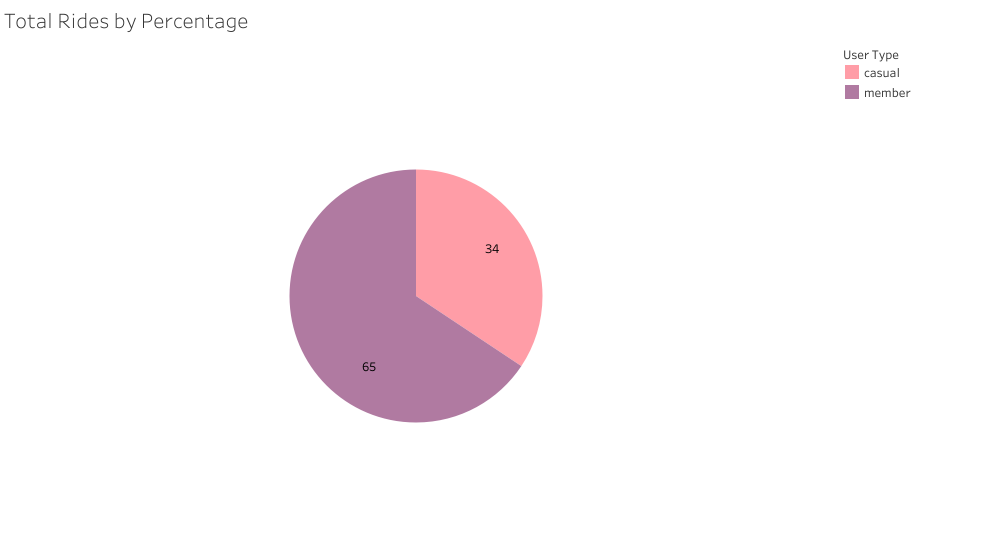
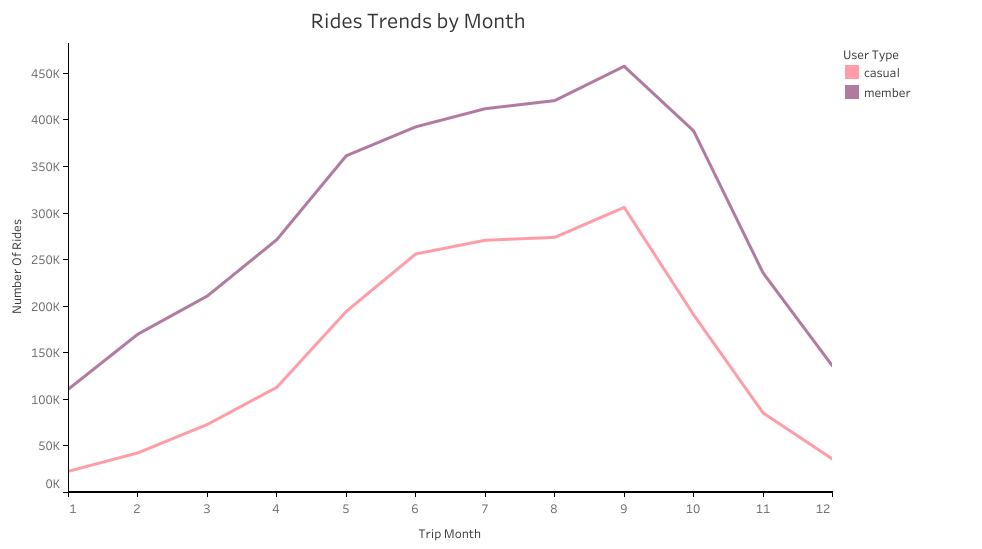

#  Ride Data Overview

### Objective:
This projects analyzes 12 months data to uncover trends, identify peak periods, and provide actionable insights to maximize annual memberships.

## Procedure
This project analyzes 12 months (Feb 2024 - Jan 2025) of ride data using `PostgreSQL` for data cleaning, exploration, analysis and `Tableau` for visualization.

# Questions Asked

1. How do annual members and casual riders use Cyclistic bikes differently? 
2. Why would casual riders buy Cyclistic annual memberships?  
3. How can Cyclistic use digital media to influence casual riders to become members?

# Tools Used

- Data source: The data has been made available by Motivate International Inc, available for download from the Google Data Analytics Cerificate Course. The dataset includes 12 CSV files, each representing one month's ride data from **February 2024 to January 2025**.
- `PgAdmin 4`: Data cleaning was performed using **SQL** in `PostgreSQL` and involved  Removing duplicate entries, handling null values in key columns, correcting inconsistent date formats.
- `Tableau`: For data visualizations

# Analysis
## 1.  Data Cleaning

I created the table first in PostgreSQL using the create table menu, the imported the files into the table, for each file, representing each month. after which i started the cleaning process; renaming columns, renaming NULL values, ensuring datatype consistencies and handling duplicate values.

``` sql
-- check consistency of ride_id columns

SELECT
  LENGTH(ride_id) AS ride_id_length
from rides
group by ride_id
having length(ride_id) <> 16

-- replacing the NULL values with unknown

UPDATE rides
SET start_station_name = 'Unknown'
WHERE start_station_name IS NULL

```

Take a look at my detailed file here
[data cleaning](Cyclistic_data/sql_queries/01_data_cleaning.sql)

## 2. Data Exploration
Next, i proceeded to create columns for analysis such as trip_duration, day_of_week . Also ran summary ststistics to get an overview, and check for inconsistencies and i found some incorrect values, and i handled them. 

``` sql
-- Create column 'trip_duration'
ALTER TABLE rides_clean
ADD COLUMN trip_duration INTERVAL

-- Summary analysis
SELECT user_type,
       MAX(trip_duration) AS max_trip,
       MIN(trip_duration) AS min_trip,
       AVG(trip_duration) AS avg_trip
FROM rides_clean
GROUP BY user_type

```
See the detailed file here:
[data_exploration](Cyclistic_data/sql_queries/02_data_exploration.sql)

## 3. Data Analysis
 I created a temporary table for my analysis, with only the columns I wanted to work with. Then, my analysis:

### 3. i. Average Trip per user

#### Visualize the result

``` sql
SELECT user_type,
  DATE_TRUNC('seconds', AVG(trip_duration)) AS avg_trip_duration
FROM rides_temp
GROUP BY user_type

```
#### Results
[Average trip Duration](Cyclistic_data/csv_result_files/avg_rides_users.csv)

#### Insights

 - On average, members take more trips than casual riders.

### 3. ii.  Percentage of Rides Counts

#### Visualize the result

```sql
-- Count of trips by user_types and percentages
WITH total_rides AS (
  SELECT COUNT(*) AS total 
  FROM rides_temp
)
SELECT user_type,
    COUNT(ride_id) AS ride_count,
	ROUND((COUNT(ride_id) * 100) / (SELECT total FROM total_rides), 2) AS percentages
FROM rides_temp
GROUP BY user_type
ORDER BY ride_count DESC

```

#### Results
This visual shows the count by percentage of rides by different user types



*Pie chart showing percentages of users' rides*


#### Insights

- Members take more rides by percentage counts (65%) than casual members (~ 35%); this implies they (members) form the core customer base.
  
- With this data spread per month across a year, there may be seasonal spikes where casual users increase (e.g., summer, holidays). Analyzing this by month could reveal trends for better marketing timing.

### 3. iii. Monthly Rides Trends

#### Visualize the result

``` sql
-- Rides per month
SELECT 
	COUNT(ride_id) AS number_of_rides,
	user_type,
    trip_month
FROM rides_temp
GROUP BY user_type,trip_month
ORDER BY trip_month

```

#### Results
This viz shows the Monthly rides trends for different users



*Line graph showing users' monthly ride trend*


#### Insights

- For casual riders, the line graph shows there is a gradual increase in rides early in the year, suggesting riders are more active as the weather improves or during holidays.
  
- Also, there is a first Peak in June, which might align with summer activities, travel, or outdoor events. And a second Peak in September, which could indicate back-to-school commuting, pleasant weather, or local events.
  
- The members line graph shows a similar pattern, except that it first peaks in May, suggesting member engagement is strong before casual riders peak. This could indicate regular commuters, fitness routines, or annual membership renewals.
  
- The highest peak on the graph in September aligns with casual users, possibly indicating that both groups respond to seasonal trends.


### 3. iv. Peak days of the week

#### Visualize the results

``` SQL
-- Rides per day of week

SELECT 
  COUNT(ride_id) AS number_of_rides,
  user_type,
  day_of_week
FROM rides_temp
GROUP BY user_type, day_of_week
ORDER BY day_of_week;

```

#### Results

This visual shows the Peak days of the week by users' rides


*Bar chart showing busiest days of the week*

#### Insights

- The viz includes side-by-side column bar charts for different user types. The casual bar trend in a U shaped pattern starts from a peak on Sunday, dips, then peaks on Saturday, suggesting mostly weekend rides and usage.
  
- The members bars trends in an unside down U-shape patter, starts from sunday, increases and peaks at Wednesday, then begins to decrease to wards sunday, indicating more work or formal usuage.


### 3. v. Peak hours of the day

#### Visualize the results 

``` SQL
-- Rides per Hour of the day
SELECT
  COUNT(ride_id) AS number_of_rides,
  user_type,
  hour_of_day
FROM rides_temp
GROUP BY user_type, hour_of_day
ORDER BY hour_of_day

```

#### Results

This viz shows peak ride hours for users in 24 hours


*stacked bar charts displaying peak ride hours in a day*

#### Insights

- Morning Rush (6 AM - 9 AM): Noticeable spike in rides, especially for members. This suggests commuter patterns, likely tied to work or school schedules.
 
- Midday Plateau (12 PM - 2 PM): Rides remain relatively stable but lower than peak periods. Members still contribute steadily, possibly for errands or short trips.
  
- Evening Peak (4 PM - 6 PM): This is the highest activity period for both user types, with casual riders contributing significantly. This aligns with after-work commutes, social outings, or evening leisure activities.

- Night Decline (Post 7 PM): A sharp decline follows, indicating reduced mobility at night.
  

 ### 3. vi. Most Frequently used Start Stations

 #### Visualize the results

 ``` sql
-- Top 10 start_station by users

SELECT
   user_type,
   start_station_name,
   start_lat,
   start_lng,
   COUNT(ride_id) AS number_of_rides
FROM rides_temp
WHERE start_station_name != 'Unknown'
GROUP BY user_type, start_station_name, start_lat, start_lng
ORDER BY number_of_rides DESC
LIMIT 10

```

#### Results

This visualization shows the top 10 start stations for each ride trips


*symbol map showing 9 stations, with 1 farther downwards*

#### Insights

- Casual Riders (Pink Circles): Streeter Dr & Grand Ave and DuSable Lake Shore Dr & Monroe St are the most popular starting points.
  
- These stations are near tourist hotspots or waterfront areas, suggesting casual riders may be tourists or leisure users.

- Member Riders (Purple Stars): Popular stations like Kingsbury St & Kinzie St, Clinton St & Madison St, and Clark St & Elm St are concentrated near downtown or business districts — indicating members are likely commuters or regular users.

- Waterfront areas (e.g., DuSable Lake Shore Dr) show strong engagement from both user types, highlighting these as prime cycling zones.

### 3. vii. Rideable Types

#### Visualize the results

``` SQL
-- ridesble type by users
SELECT
  user_type,
  rideable_type,
  COUNT(ride_id) AS number_of_rides
FROM rides_temp
GROUP BY user_type, rideable_type
ORDER BY  rideable_type

```
#### Results
This visualization shows the different rideable types for different users


*Side-by-side bar chart showing rideable types for user*

#### Insights
- Electric bikes are the most popular ride type for both casual and member users; members have a particularly strong preference for electric bikes, exceeding 1.8 million rides.

- Classic bikes are the second most used ride type, with members showing higher usage than casual riders.

- Electric scooters have minimal engagement across both user groups, suggesting they may be less accessible or least preferred.


# What I Learned

- This project exposed me to using tools such as `PostgreSQL` For data extraction, cleaning, and analysis; `Tableau` For creating clear and insightful visualizations; and `GitHub` — For version control.

-  I also improved my data Visualization Skills by creating meaningful visualizations in `Tableau` that highlight trends, user behavior, and ride patterns and focused on clear labels, color schemes, and legends to improve readability.


# Recommendations (Overall insights)

- Since casual riders contribute significantly during peak seasons, **introducing discounts or promotions** during off-peak hours (e.g., weekday mornings) could help balance bike demand.

- Both casual and member users heavily favor electric bikes. **Increasing the availability of electric bikes**, especially in high-traffic stations, can improve user satisfaction and reduce shortages.

- Stations like DuSable Lake Shore Dr & Monroe St and Streeter Dr & Grand Ave show consistently high traffic. **Expanding docking capacity** or improving bike distribution in these areas can reduce congestion and improve service reliability.

- With peaks in May/June and September, increasing maintenance checks and staffing during these periods can **improve bike availability**, reduce downtime, and enhance customer experience.

- Since members tend to ride consistently throughout the year, **offering incentives** such as loyalty programs, referral bonuses, or family plans could further boost member engagement.


# Challenges Encountered

This project pushed me to break bounds in terms of my skills
- Managing large datasets(5 million rows when combined)  posed challenges in terms of performance and ensuring data consistency.
  
- Encountered missing values, inconsistent date formats, and incorrect entries. For example, filling gaps in ride data and ensuring accurate timestamps required additional cleaning steps.
  
- Balancing data cleaning, analysis, and visualization while ensuring each step aligned with project goals required careful planning.


# Conclusion

This project provided valuable insights into ride trends, user behavior, and bike preferences. Key findings highlighted seasonal peaks, popular stations, and electric bike dominance. Addressing data challenges improved my skills in `SQL`, data cleaning, and visualization using `Tableau`. The recommendations aim to enhance service efficiency, improve user experience, and support future growth strategies.


 


